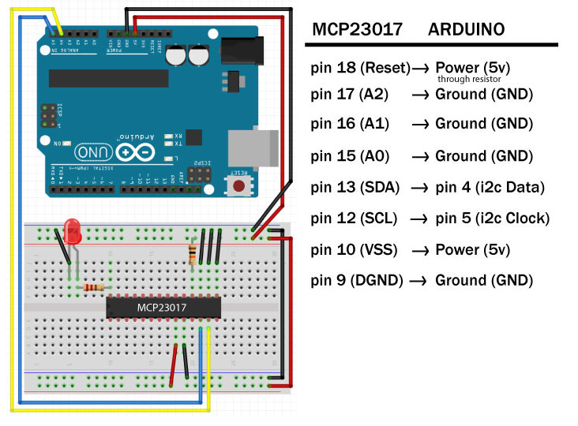

# MCP23017 GPIO Expander
## Arduino Exmaple code

### Pinout

### Installation & Configration

#### Install the Adafruit MCP23017 library
1. Open the Arduino IDE
2. Select 'Sketch' -> 'Include Library' -> 'Manage Libraries'
3. Search for '23017'
4. Click 'Install' button for the 'Adafruit MCP23017 Arduino Library...'

Done!
