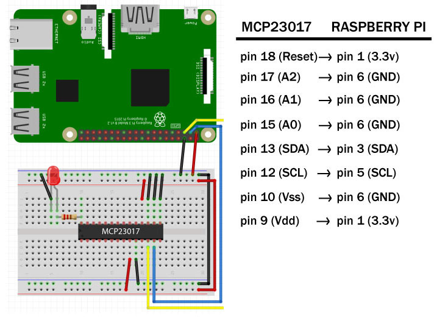

# MCP 23017 GPIO Expander
## Raspberry Pi Example

### Pinout

### Installation & Configuration

#### Install Adafruit_GPIO python module
See instructions on module GitHub repo [here](https://github.com/adafruit/Adafruit_Python_GPIO).

#### Enable I2C on Raspberry Pi
1. Run: `sudo raspi-config`
2. Select 'Interfacing Options'
3. Select 'I2C Enable/Disable automatic loading of I2C kernel module'
4. Select '<Yes>' for 'Would you like the ARM I2C interface to be enabled?'
5. Select '<Ok>'
6. Select '<Finish>'

Done!
